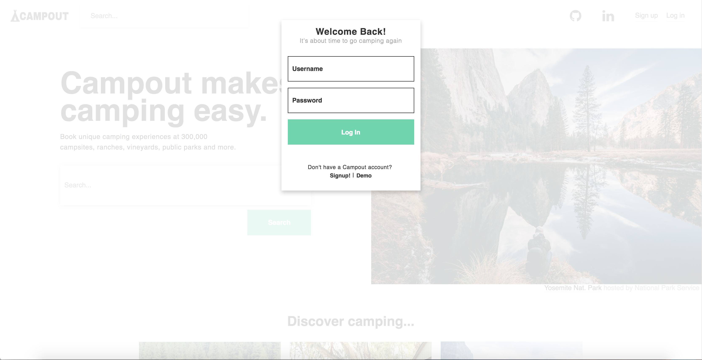

# Campout
[Live Demo](www.camp-out.herokuapp.com)

Campout is an fullstack application inspired by Hipcamp that allows users to search for campsites by location, filter sites based amenities and create bookings that will be saved on the user's profile page. I seeded the site with campsites that I have visited and ones that I plan to visit in the future!

This project was planned and built on a two-week deadline, and I plan to make enhancements with each new iteration of the application.

This README covers

- [Features](features)
- [Planning & Design](Design)
- [Technologies](Technologies)
- [Future Features](Future&%20Features)

## Features

### Signup & Login Modals
I used a ui.modal slice of state in my state shape, that can be set to true or false which will indicate if the modal is opened or closed. The modal is populated with a login or signup form by calling openModal('login') or openModal('signup') respectively. Using this approach allows the modal to be populated with any React component desired.


```js
  function Modal({modal, closeModal}) {
    if (!modal) {
      return null;
    }

    let component;
    switch (modal) {
      case 'login':
        component = <LoginFormContainer />
        break;
      case 'signup':
        component = <SignupFormContainer />
        break;
      default: 
        return null;
    }

    return (
      <div className="modal-background" onClick={closeModal}>
          { component }
        </div>
    );
  }
```


I took this approach to allow for future implementations of the modal for example, rendering errors, or alerting the user of a successful booking.

### Search


Users can search for campsites based on location, and multiple filters. I accomplished this by creating a search component which updates a ui.geoLocation slice of state with the inputted search text. Since the search field lives in the navbar across all views of my application, I  push (/discover) on to the user's history to render the discover component, if the user is not already at the discover view.

In the map component I use Google's geocoder service to translate the user's input into Latitude and Longitude coordinates, used to recenter the map when the React component updates.

```js
  centerMapOnSearch () {
    const geolocation = this.props.geoLocation
    
    this.geoCoder.geocode({ 'address': geolocation}, (results, status) => {
      if (status === "OK") {
        if (results[0]) {
          this.map.setZoom(7)
          let center = results[0].geometry.location;
          this.map.setCenter(center);
          const newBounds = this.map.getBounds();
          this.map.fitBounds(newBounds);
          this.props.receiveGeolocation("");
        } else {
          return null;
       }}
    });
  }
```
## Technologies


## Design

## Future features